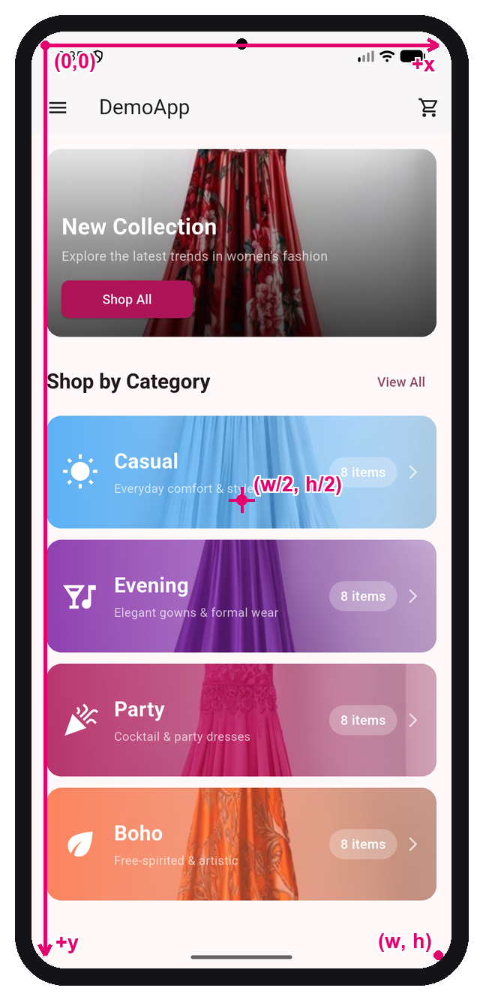
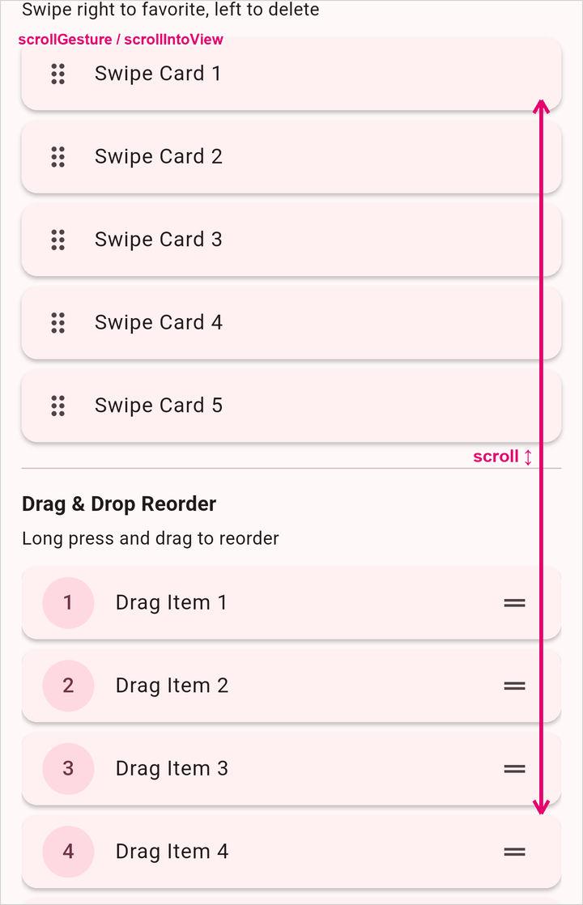
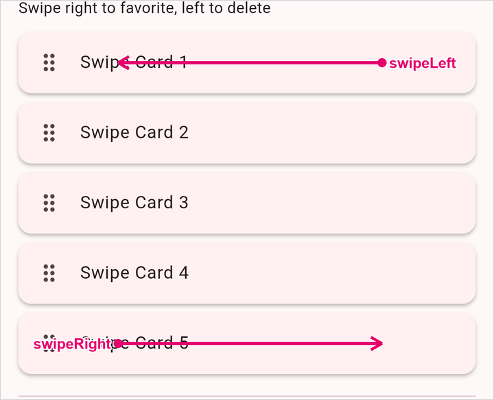
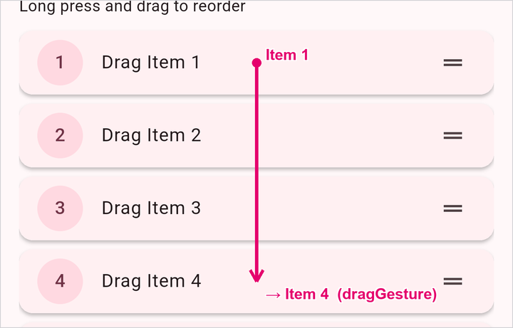
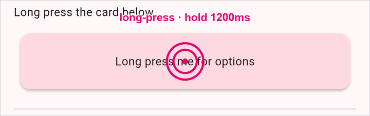
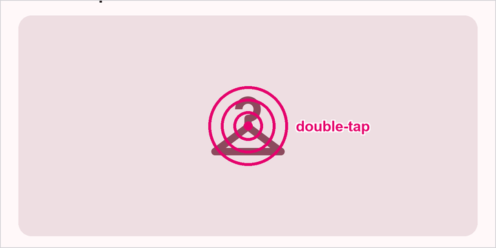
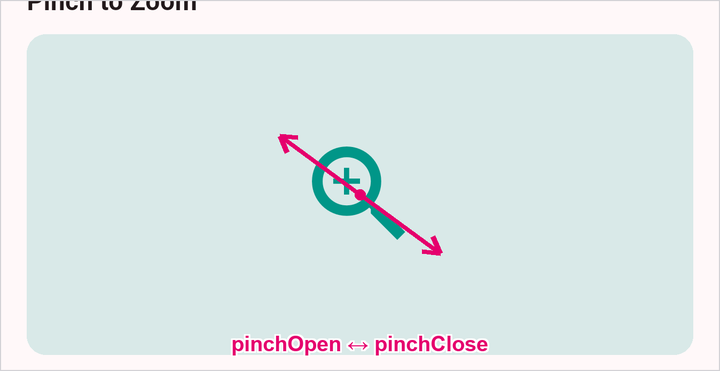

<!-- _class: lead -->

# 📱 Mobile UI Test Automation
## Session 2 — Real, Maintainable Tests

**AI-Assisted Mobile Test Automation using Claude**
4 Sundays · 2–6 PM SGT

<br>

<span class="small">Today: turn last week's flat script into a **clean, scalable test suite** — solid waits, gestures, data-driven, and **parallel** tests.</span>

---

<!-- _class: lead -->

# 👋 Welcome back

---

## Your instructor

<div class="cols">
<div>


</div>
<div>

# Syam Sasi

**Workshop Instructor** — AI-Assisted Mobile UI Test Automation

**Co-founder of [Taqelah](https://taqelah.sg/)** 🚀

<br>

🔗 [linkedin.com/in/syam-sasi](https://www.linkedin.com/in/syam-sasi/)
🌐 [taqelah.sg](https://taqelah.sg/)

</div>
</div>

---

## Where we are in the 4-Sunday arc

| Day | Theme |
|-----|-------|
| 1 ✅ | Landscape, setup, first script + locators, core commands, a login flow |
| **2 — today** | **Real, maintainable tests — sync/waits, gestures, data-driven & parallel** |
| 3 | Scaling — Page Objects, reporting, CI, cloud devices, debugging flaky tests + **Claude begins** 🤖 |
| 4 | More **Claude-driven** authoring + putting it all together |

Last week we made a test **pass**. Today we make tests we can **live with**.

---

## Recap — what you can already do

From Session 1, you can:

- 🔌 Connect a client → Appium server → emulator with **capabilities**
- 🔎 Find elements with **locators** — accessibility id 🥇, id, class name, xpath, UiAutomator
- 🎯 Run **core commands** — `click` / `setValue` (sendKeys) / `getText`
- ⏳ Use **waits** instead of `sleep` — implicit & explicit
- ✅ Drive a real **login flow** end-to-end (find → tap → type → assert)

<br>

<span class="small">Today builds directly on the login lab — we **refactor** it into something maintainable.</span>

---

## Today's goal (keep it in mind)

> ### 🎯 Take the Session 1 login test and turn it into a clean, reusable, data-driven suite.

By the end you'll have rock-solid **synchronization**, a **gesture** (scroll/swipe),
the **same test over many data rows**, and those rows running **in parallel**
across devices — in both Node and Python.

---

<!-- _class: lead -->

# ⏳ Synchronization — getting waits right

The #1 cause of flaky tests.

---

## Three kinds of waits

| Wait | What it does | When |
|------|--------------|------|
| **Implicit** | Global "retry find for N s" on *every* element lookup | Set once; blunt instrument |
| **Explicit** | Wait for a **specific condition** on a specific element | The default tool ✅ |
| **Fluent** | Explicit + custom **poll interval** + ignored exceptions | Fine-tuning |

<br>

> ❌ **Never `sleep(3)`** — too short → flaky, too long → slow. Wait for a **condition**, not a clock.

---

## Implicit waits — one global setting

Set **once** after connecting; every `find_element` then **retries** for up to N seconds.

<div class="cols">
<div>

**Python** (Appium-Python-Client)
```python
driver = webdriver.Remote(APPIUM_URL, options=options)
driver.implicitly_wait(10)     # seconds — set ONCE

# every lookup now polls for up to 10s
# before raising NoSuchElement:
login = driver.find_element(*LOGIN_BTN)
login.click()
```

</div>
<div>

**Node (WDIO)** — in `wdio.conf.js`
```js
export const config = {
  // default timeout for all
  // waitFor* / auto-wait commands (ms)
  waitforTimeout: 10000,
}
```

</div>
</div>

<span class="small">⚠️ Implicit only waits for the element to **exist** (presence) — not visible, not enabled. A blunt safety net.</span>

---

## Explicit waits — the conditions that matter

<div class="cols">
<div>

**Python**
```python
wait = WebDriverWait(driver, 15)
wait.until(EC.presence_of_element_located(L))      # in the DOM
wait.until(EC.visibility_of_element_located(L))    # visible
wait.until(EC.element_to_be_clickable(L))          # tappable
```

</div>
<div>

**Node (WDIO)**
```js
// WebdriverIO auto-waits on every command…
await $('~Login').click()      // waits to exist+interactable
// …and explicit when you need a condition:
await $('~View All').waitForDisplayed({ timeout: 15000 })
```

</div>
</div>

<br>

<span class="small">**presence** = exists · **visibility** = on screen · **clickable** = visible + enabled. Pick the weakest one that proves what you need.</span>

---

## Explicit wait conditions — the toolbox

<div class="cols">
<div>

**Python** — `expected_conditions as EC`
```text
# exists / visible
presence_of_element_located
visibility_of_element_located
presence_of_all_elements_located
visibility_of_all_elements_located
# interactable
element_to_be_clickable
# gone / changed
invisibility_of_element_located
staleness_of
# content / state
text_to_be_present_in_element
text_to_be_present_in_element_value
element_to_be_selected
```

</div>
<div>

**Node (WDIO)** — `await $(el).waitFor*`
```text
waitForExist        # exists
waitForDisplayed    # visible       ← native ✅
waitForEnabled      # not disabled  ← native ✅
waitForStable       # done animating
waitForClickable    # BROWSER ONLY ⚠️

browser.waitUntil(fn)   # ANY custom check
```
Options on every `waitFor*`:
```js
{ timeout, interval, reverse, timeoutMsg }
// reverse: true → wait for the OPPOSITE
//   e.g. spinner to disappear
```

</div>
</div>

<span class="small">Each returns the element (or `true`) the **instant** it's satisfied. ⚠️ In a **native** app, `waitForClickable`/`isClickable` are browser-only — use `waitForDisplayed` + `waitForEnabled`. Wait for things to **go away** with `invisibility_of_*` / `reverse: true`.</span>

---

## Explicit waits in action — ❌ vs ✅

Our demo app shows a **splash** before the login screen. `sleep` *guesses* the delay;
an explicit wait *knows* the moment the field is ready.

<div class="cols">
<div>

❌ **Brittle** — fixed guess
```python
import time
time.sleep(5)                 # hope splash is gone
driver.find_element(*USERNAME) \
      .send_keys(USER)        # flaky if slow,
                              # wasteful if fast
```

</div>
<div>

✅ **Reliable** — wait for the condition
```python
wait = WebDriverWait(driver, 15)
user = wait.until(
    EC.element_to_be_clickable(USERNAME))
user.click()
user.send_keys(USER)          # runs the instant
                              # the field is ready
```

</div>
</div>

<span class="small">Returns as soon as the condition is true — never the full 15s unless it has to. Same idea in WDIO: `await $(USERNAME).waitForEnabled()` then act.</span>

---

## Fluent waits — explicit, fine-tuned

A **fluent wait** is just an explicit wait with two knobs turned: a custom **poll interval**
and a list of **transient exceptions to ignore** while polling (e.g. a brief stale element
as a screen re-renders).

<div class="cols">
<div>

**Python** — `WebDriverWait` *is* the fluent wait
```python
from selenium.common.exceptions import (
    StaleElementReferenceException)

wait = WebDriverWait(
    driver,
    timeout=20,
    poll_frequency=0.5,            # check every 0.5s
    ignored_exceptions=[           # swallow these
        StaleElementReferenceException],
)
wait.until(EC.element_to_be_clickable(LOGIN_BTN))
```

</div>
<div>

**Node (WDIO)** — same knobs on any `waitFor*`
```js
await $(LOGIN_BTN).waitForEnabled({
  timeout: 20000,
  interval: 500,                  // poll every 0.5s
  timeoutMsg: 'Login never enabled',
})

// or a custom condition:
await browser.waitUntil(fn,
  { timeout: 20000, interval: 500 })
```
<span class="small">WDIO's retry already swallows transient "not found" errors for you.</span>

</div>
</div>

<span class="small">Reach for it when default polling is too chatty/coarse, or an element is briefly **stale** mid-transition. Otherwise plain explicit is enough — and it's still **not** `sleep`.</span>

---

## Don't mix implicit + explicit

- Setting **both** can make timeouts **add up** unpredictably (waits stack)
- Pick a strategy:
  - **WebdriverIO** → built-in **auto-wait**; add `waitForDisplayed` for assertions
  - **Python** → set a small/no implicit wait, use **explicit** `WebDriverWait` everywhere
- Put the wait in a **shared helper** so every test is synced the same way

> Synchronization is a property of your **framework**, not something you sprinkle per-test.

---

## When to use which wait

| Wait | Reach for it when… | Watch out |
|------|--------------------|-----------|
| **Implicit** | quick scripts/spikes; a **small global floor** so finds survive minor lag | too blunt for real flows — **never** stack it with explicit |
| **Explicit** ✅ | **almost always** — waiting on a **specific state** (displayed, enabled, gone, text) | *(this is the default — reach here first)* |
| **Fluent** | explicit isn't enough: **tune the poll interval**, or **ignore transient** stale errors mid-animation | premature tuning — default polling usually works |

> 🎯 **Default to explicit.** Optionally add a *small* implicit floor — but never stack both. Use **fluent** only when you need the extra knobs. And never `sleep`.

<span class="small">Put the chosen wait in a **shared helper / base** so the whole suite syncs the same way.</span>

---

## 🧪 Lab — implicit vs explicit vs fluent

Now **feel** the difference. Drive the Session 1 login flow **three times** on the demo app —
its **splash screen** is the thing you wait on.

- **`implicit`** — one global timeout; plain finds **retry** past the splash
- **`explicit`** — `WebDriverWait` / `waitForDisplayed` **per step**
- **`fluent`** — explicit + a custom **poll interval** / **ignored exceptions**

<br>

> **Try it:** drop the implicit timeout to **1s** and watch it fail — that's why explicit wins.

<span class="small">Folder: [`waits-lab/`](waits-lab/README.md) · run commands on the next two slides (Node, then Python). Prereqs: emulator booted · `appium` running · demo APK installed.</span>

---

## ▶️ Running waits-lab — Node

**One-time:** install the demo app → `adb install DemoApp-v1.0.0.apk` (from the Session 1 GitHub release). Terminals 1 & 2: `emulator -avd Pixel_10_Pro_XL` + `adb devices`, then `appium` (port 4723).

```bash
# Terminal 3 — run both specs  (npm is identical on macOS & Windows)
cd waits-lab/node                # Windows: cd waits-lab\node
npm install                      # first time only
npm test                         # → wdio run ./wdio.conf.js
```

<span class="small">Runs `implicit.e2e.js` + `explicit.e2e.js` + `fluent.e2e.js` — all three log in past the splash. ✅</span>

---

## ▶️ Running waits-lab — Python

**One-time:** `adb install DemoApp-v1.0.0.apk` (Session 1 release). Terminals 1 & 2: `emulator -avd Pixel_10_Pro_XL` + `adb devices`, then `appium`. **Terminal 3 — run the tests:**

<div class="cols">
<div>

### 🍎 macOS / Linux
```bash
cd waits-lab/python
python3 -m venv .venv
source .venv/bin/activate
pip install -r requirements.txt
pytest
```

</div>
<div>

### 🪟 Windows (PowerShell)
```powershell
cd waits-lab\python
python -m venv .venv
.venv\Scripts\Activate.ps1
pip install -r requirements.txt
pytest
```

</div>
</div>

<span class="small">**Why a venv?** Homebrew/system Python (PEP 668) blocks global `pip install` — the venv sidesteps it. PowerShell blocks activation? `Set-ExecutionPolicy -Scope CurrentUser RemoteSigned` once. (cmd.exe: `.venv\Scripts\activate.bat`.)</span>

---

<!-- _class: lead -->

# 👆 Gestures

Scroll, swipe, long-press — driving apps like a real thumb.

---

## 📐 Screen coordinates — how a tap is placed

Every gesture resolves to an **(x, y) in pixels** — origin **`(0,0)` = top-left**, **x → right**, **y ↓ down**, bottom-right = **`(w, h)`**.

<div class="cols">
<div>



</div>
<div>

**Get the size → compute points**
```python
# Python
s = driver.get_window_size()   # {'width':1080,'height':2400}
cx, cy = s['width']//2, s['height']//2          # (540, 1200)
# swipe UP = bottom → top, same x:
start = (cx, int(s['height']*0.8))              # (540, 1920)
end   = (cx, int(s['height']*0.2))              # (540, 480)
```
```js
// WDIO
const { width, height } = await driver.getWindowSize()
const cx = Math.round(width / 2)
const start = { x: cx, y: Math.round(height * 0.8) }  // (540, 1920)
const end   = { x: cx, y: Math.round(height * 0.2) }  // (540, 480)
```

</div>
</div>

<span class="small">⚠️ Sizes differ per device — **compute from width/height (or %)**, never hard-code pixels.</span>

---

## Two ways to gesture

<div class="cols">
<div>

**1. `mobile:` driver commands** 🥇
High-level, reliable, per-platform.
```js
await driver.execute('mobile: scrollGesture', {
  left: 100, top: 400, width: 200, height: 800,
  direction: 'down', percent: 1.0
})
```

</div>
<div>

**2. W3C Actions**
Low-level pointer API, cross-platform, more verbose.
```python
from selenium.webdriver.common.actions \
  import interaction
# build pointer down → move → up
```

</div>
</div>

<br>

<span class="small">Prefer **`mobile:`** commands (`scrollGesture`, `swipeGesture`, `longClickGesture` on Android; `mobile: scroll` / `mobile: swipe` on iOS) — they're simpler and far less flaky than hand-rolled Actions.</span>

---

## Scroll — up & down

Flick the list to bring an off-screen widget into view (here: the **right-edge band**).

<div class="cols">
<div>



</div>
<div>

**Node** — scroll until visible
```js
await $('android=new UiScrollable(' +
  'new UiSelector().scrollable(true))' +
  '.scrollIntoView(new UiSelector()' +
  '.descriptionContains("Pinch to Zoom"))')
```
**Python** — flick up by coordinates
```python
driver.execute_script('mobile: scrollGesture',
  {**band, 'direction': 'up', 'percent': 1.0})
```

</div>
</div>

<span class="small">`scrollIntoView` scrolls **forward**; `mobile: scrollGesture` flicks **up** — `band` from `getWindowSize`.</span>

---

## Swipe — left & right

Flick a card off the list — **left = delete, right = favourite**.

<div class="cols">
<div>



</div>
<div>

**Node (WDIO)**
```js
const card = await $('~Swipe Card 1')
await driver.execute('mobile: swipeGesture', {
  elementId: card.elementId,
  direction: 'left', percent: 0.9 })
```
**Python**
```python
driver.execute_script('mobile: swipeGesture',
  {'elementId': card.id,
   'direction': 'left', 'percent': 0.9})
```

</div>
</div>

<span class="small">Assert the swiped cards are **hidden** — they left the list.</span>

---

## Drag & drop

Press-hold an item, move to the target, release — the list **reorders**.

<div class="cols">
<div>



</div>
<div>

**Node (WDIO)**
```js
const src = await $(item1)
const { x, y } = await centre($(item4))
await driver.execute('mobile: dragGesture', {
  elementId: src.elementId,
  endX: x, endY: y, speed: 1200 })
```
**Python**
```python
driver.execute_script('mobile: dragGesture',
  {'elementId': src.id,
   'endX': x, 'endY': y, 'speed': 1200})
```

</div>
</div>

<span class="small">Drop "Drag Item 1" on "Drag Item 4" → assert it landed at position 3.</span>

---

## Long-press

Press-and-hold (`duration` ms) on the card to open its context menu.

<div class="cols">
<div>



</div>
<div>

**Node (WDIO)**
```js
await driver.execute('mobile: longClickGesture', {
  elementId: card.elementId,
  duration: 1200,
})
```
**Python**
```python
driver.execute_script('mobile: longClickGesture',
  {'elementId': card.id, 'duration': 1200})
```

</div>
</div>

<span class="small">Long-press the card → assert the **Copy** menu appears.</span>

---

## Double-tap

Two quick taps on the image's centre — zoom in/out.

<div class="cols">
<div>



</div>
<div>

**Node (WDIO)**
```js
await driver.execute('mobile: doubleClickGesture', {
  elementId: image.elementId,
})
```
**Python**
```python
driver.execute_script('mobile: doubleClickGesture',
  {'elementId': image.id})
```

</div>
</div>

<span class="small">Fires at the element's centre — `(672, 1780)` on this device.</span>

---

## Pinch — in & out

`pinchOpenGesture` spreads fingers (zoom **in**), `pinchCloseGesture` brings them together (zoom **out**).

<div class="cols">
<div>



</div>
<div>

**Node (WDIO)**
```js
await driver.execute('mobile: pinchOpenGesture',
  { elementId: image.elementId, percent: 0.75 })
await driver.execute('mobile: pinchCloseGesture',
  { elementId: image.elementId, percent: 0.75 })
```
**Python**
```python
driver.execute_script('mobile: pinchOpenGesture',
  {'elementId': image.id, 'percent': 0.75})
```

</div>
</div>

<span class="small">💡 **Appium Inspector**: right-click an element → **Gestures** to preview before scripting.</span>

---

## 🧪 Lab — gestures

Six gestures on the demo app's **Gesture Demo** screen (login → nav drawer → **Gestures**), each with a real assertion.

<div class="cols">
<div>

**[`gestures-lab/`](gestures-lab/README.md)**
```bash
# 🟢 Node — all 6 specs
cd gestures-lab/node
npm install && npm test

# 🐍 Python — all 6 tests
cd gestures-lab/python
python3 -m venv .venv         # Windows: python -m venv .venv
source .venv/bin/activate     # Windows: .venv\Scripts\Activate.ps1
pip install -r requirements.txt
pytest
```

</div>
<div>

You'll run:
- **scroll** ↑↓ · **swipe** ←→ (cards leave)
- **drag & drop** (list reorders)
- **long-press** (Copy menu) · **double-tap**
- **pinch** in/out

</div>
</div>

<span class="small">Prereqs: emulator booted · `appium` running · demo APK installed.</span>

---

<!-- _class: lead -->

# 🔢 Data-driven testing

One test, many inputs — without copy-paste.

---

## Why data-driven

- Same flow, many cases: **valid / invalid / empty** credentials, multiple products
- Keep **logic in one test**, **data in a list** — add a row, get a new case
- Each row reported as its **own pass/fail** — you see exactly which input broke

<br>

> Pattern: **parametrize** the test over a table of `(input, expected)` rows.

---

## Parametrize — Python (pytest)

```python
import pytest

CREDENTIALS = [
    ("emma@demoapp.com", "10203040", True),    # valid → home screen
    ("emma@demoapp.com", "wrongpass",  False),  # bad password → error
    ("",                 "",          False),   # empty → stays on login
]

@pytest.mark.parametrize("user, pwd, should_pass", CREDENTIALS)
def test_login_cases(driver, user, pwd, should_pass):
    driver.find_element(*USERNAME).send_keys(user)
    driver.find_element(*PASSWORD).send_keys(pwd)
    driver.find_element(*LOGIN).click()
    assert bool(driver.find_elements(*VIEW_ALL)) == should_pass
```

<span class="small">`pytest -v` → **three** test lines, one per row. 🟢🔴🔴</span>

---

## Data-driven — Node (WebdriverIO)

<div class="cols">
<div>

**Inline table**
```js
const cases = [
  ['emma@demoapp.com', '10203040', true],
  ['emma@demoapp.com', 'nope',     false],
]

cases.forEach(([user, pwd, ok]) => {
  it(`login: ${user}`, async () => {
    await $(USERNAME).setValue(user)
    await $(PASSWORD).setValue(pwd)
    await $('~Login').click()
    expect(await $('~View All').isDisplayed()).toBe(ok)
  })
})
```

</div>
<div>

**External data**
```js
// data/users.json → import & loop
import users from '../data/users.json'
users.forEach(u => it(...))
```

</div>
</div>

<span class="small">Generating one `it()` per row gives you isolated, individually-reported cases.</span>

---

## Data from a file — JSON or CSV

Keep the rows **out of the test** — load them from a file. Same rows, same test, swap the loader.

<div class="cols">
<div>

**JSON**
```js
// Node
const rows = JSON.parse(
  readFileSync('credentials.json', 'utf-8'))
```
```python
# Python
rows = json.load(open('credentials.json'))
```

</div>
<div>

**CSV**
```js
// Node — split lines & commas (or csv-parse)
const rows = parseCsv(
  readFileSync('credentials.csv', 'utf-8'))
```
```python
# Python — stdlib csv
import csv
rows = list(csv.DictReader(open('credentials.csv')))
```

</div>
</div>

<span class="small">⚠️ CSV is all **strings** → coerce (`"true"` → `true`). The lab runs the suite **three ways** — inline array, CSV, and JSON.</span>

---

## 🧪 Lab — data-driven

One login test, the same 4 cases from **three sources — inline · CSV · JSON** — each row a separate pass/fail.

- ✅ **valid** → reaches home
- ❌ **wrong password** · **unknown user** · **empty fields** → stay on login

<br>

> **Isolation:** a **fresh app per row** (Node `reloadSession` · Python function-scoped fixture) — the same discipline **parallel** needs.

<span class="small">Folder: [`data-driven-lab/`](data-driven-lab/README.md) · run commands on the next two slides (Node, then Python). Add a row to the JSON → a new case in **both** stacks.</span>

---

## ▶️ Running data-driven-lab — Node

**One-time:** install the demo app → `adb install DemoApp-v1.0.0.apk` (Session 1 release). Terminals 1 & 2: `emulator -avd Pixel_10_Pro_XL` + `adb devices`, then `appium` (port 4723).

```bash
# Terminal 3 — one it() per credential row  (npm is identical on macOS & Windows)
cd data-driven-lab/node          # Windows: cd data-driven-lab\node
npm install                      # first time only
npm test                         # → wdio run ./wdio.conf.js
```

<span class="small">`beforeEach` reloads the session, so each row starts on a fresh login screen. ✅</span>

---

## ▶️ Running data-driven-lab — Python

**One-time:** `adb install DemoApp-v1.0.0.apk` (Session 1 release). Terminals 1 & 2: `emulator -avd Pixel_10_Pro_XL` + `adb devices`, then `appium`. **Terminal 3 — run the tests:**

<div class="cols">
<div>

### 🍎 macOS / Linux
```bash
cd data-driven-lab/python
python3 -m venv .venv
source .venv/bin/activate
pip install -r requirements.txt
pytest -v
```

</div>
<div>

### 🪟 Windows (PowerShell)
```powershell
cd data-driven-lab\python
python -m venv .venv
.venv\Scripts\Activate.ps1
pip install -r requirements.txt
pytest -v
```

</div>
</div>

<span class="small">**Why a venv?** Homebrew/system Python (PEP 668) blocks global `pip install` — the venv sidesteps it. PowerShell blocks activation? `Set-ExecutionPolicy -Scope CurrentUser RemoteSigned` once. The function-scoped `driver` fixture gives **each row a fresh session**.</span>

---

<!-- _class: lead -->

# ⚡ Parallel testing

Many test cases run one after another = slow. Run them side-by-side to cut execution time.

---

## Why parallel

- A suite of **X test cases** run sequentially = **X × per-test time** — split across devices to **cut total time**
- Each test is **independent** (fresh login, own data row) → safe to run **at the same time**
- Parallelism needs **more devices**: one session per emulator/simulator
- Same idea scales later to **cloud device farms** (Session 3)

<br>

> Rule of thumb: tests must be **isolated** — no shared state, no fixed order — *before* you parallelize.

---

## Two ways to go parallel

<div class="cols">
<div>

**✂️ Shard — split for speed**
Divide the suite; each test runs **once**, on one device.
- N tests across D devices → ~**N ÷ D** wall-clock
- 🎯 goal: **finish faster**
- 🧪 **this lab**: device A runs 2 rows, device B runs the other 2

</div>
<div>

**🔲 Matrix — same suite on every device**
Run the **whole** suite on **each** device.
- N tests × D devices → more runs, **not** faster
- 🎯 goal: **does it work everywhere?**
- e.g. phone vs tablet · Android 14 vs 12 · iOS vs Android

</div>
</div>

<br>

> Same machinery (a session per device + isolation) — only **who runs what** differs. **This lab shards** because the goal is cutting execution time; swap to a matrix when you care about **device coverage**.

---

## How Appium supports parallel testing

Appium is a **WebDriver server** — each test opens its own **session**. A server *can* hold many sessions, but for parallel runs the safer default is **one server per device**.

<div class="cols">
<div>

**✅ Recommended: one server per device**
Run an `appium` process per device on its own port (`-p 4723`, `-p 4724`, …) because:
- 🛡️ **fault isolation** — one server crashing/hanging never takes the others down
- 🧵 **no contention** — sessions don't share one Node process / event loop
- 📄 **clean logs** — one log stream per device
- ☁️ mirrors how **cloud grids** scale (Session 3)

</div>
<div>

**Each session also needs isolation**
- 🖥️ its **own server** → `--port`
- 🆔 a **distinct device** → `appium:udid`
- 🔌 its **own driver ports** so they don't collide:
  - Android (UiAutomator2) → `systemPort`
  - iOS (XCUITest) → `wdaLocalPort`

</div>
</div>

<span class="small">A single server holding many sessions is fine for a quick local run, but one wedged session can stall the whole process — so per-device servers are the default. Your runner (WDIO `maxInstances`, pytest-xdist `-n`) launches the sessions; you point each at its server.</span>

---

## Starting Appium servers for parallel runs

**One server per device** — launch each on its own **port** (and its own log), then point each test session at the matching server.

<div class="cols">
<div>

**Spin up two servers**
```bash
# Terminal A — first emulator
appium -p 4723 \
  --log appium-5554.log

# Terminal B — second emulator
appium -p 4724 \
  --log appium-5556.log
```

</div>
<div>

**Handy server args**
```text
-p,  --port           listen port (unique!)
-a,  --address        bind address
-pa, --base-path      URL base path
-g,  --log            per-server log file
     --relaxed-security  enable risky features
-dc, --default-capabilities  bake in caps (JSON)
```

</div>
</div>

<span class="small">⚠️ **Server port** (`-p`) ≠ **driver port** — `systemPort` / `wdaLocalPort` are per-session **capabilities**, not server args. Give each parallel session **its own server (`-p`) *and* its own driver ports**.</span>

---

## Per-platform isolation — Android vs iOS

The **server** start command is the same on both platforms (`appium -p <port>`). What differs is the **per-session capabilities** each driver needs so parallel sessions don't fight over device-side ports.

<div class="cols">
<div>

**🤖 Android — UiAutomator2**
```js
{
  'appium:udid': 'emulator-5554',
  'appium:systemPort': 8200,        // ADB bridge
  'appium:chromedriverPort': 9515,  // WebView
  'appium:mjpegServerPort': 7810,   // screen stream
}
```

</div>
<div>

**🍎 iOS — XCUITest**
```js
{
  'appium:udid': '<simulator-UDID>',
  'appium:wdaLocalPort': 8100,      // WebDriverAgent
  'appium:derivedDataPath': '/tmp/wda-0', // own Xcode build
  'appium:mjpegServerPort': 7810,   // screen stream
}
```

</div>
</div>

<span class="small">🔑 Offset **every port by the worker index** (`8200 + i`, `8100 + i`, …) so worker 0/1/2 never collide. iOS also needs a **separate `derivedDataPath`** per simulator — parallel WebDriverAgent builds sharing one DerivedData dir corrupt each other. (This is exactly what `taqwright` does per worker.)</span>

---

## What each argument does

| Arg / capability | Platform | What it does |
|---|---|---|
| `-p` / `--port` *(server)* | both | Port the **Appium REST API** listens on — one per server |
| `appium:udid` | both | Pins the session to a **specific device** — emulator serial / simulator UDID |
| `appium:systemPort` | 🤖 Android | UiAutomator2 ↔ **ADB bridge** port — **required**, must be unique |
| `appium:chromedriverPort` | 🤖 Android | Port for **ChromeDriver** — only when automating **WebViews / hybrid** apps |
| `appium:wdaLocalPort` | 🍎 iOS | Local port to the **WebDriverAgent** server on the sim — **required**, unique |
| `appium:derivedDataPath` | 🍎 iOS | Own **Xcode DerivedData** dir per sim — stops parallel WDA builds corrupting each other |
| `appium:mjpegServerPort` | both | Port for the **MJPEG screen stream** — only if you stream screenshots/video |

<span class="small">**Required for parallel:** unique `--port` per server · `udid` · `systemPort` (Android) / `wdaLocalPort` + `derivedDataPath` (iOS). The rest are feature-dependent.</span>

---

## Parallel — Node (WebdriverIO)

Set **`maxInstances`** and give each capability its **own server (`port`) + device + ports + specs**:

```js
// wdio.conf.js — WDIO reads `port`/`hostname` per capability
export const config = {
  maxInstances: 2,                 // up to 2 sessions at once
  capabilities: [
    { port: 4723,                                  // device A's own Appium server
      platformName: 'Android', 'appium:automationName': 'UiAutomator2',
      'appium:udid': 'emulator-5554', 'appium:systemPort': 8200,
      specs: ['./test/specs/group-a.e2e.js'] },
    { port: 4724,                                  // device B's own Appium server
      platformName: 'Android', 'appium:automationName': 'UiAutomator2',
      'appium:udid': 'emulator-5556', 'appium:systemPort': 8201,
      specs: ['./test/specs/group-b.e2e.js'] },
  ],
}
```

<span class="small">Each capability connects to its **own Appium server** (`port`) and runs its own `specs` shard → ~half the wall-clock. Per-session `systemPort` (iOS `wdaLocalPort`) still required, or the driver bridges collide.</span>

---

## Parallel — Python (pytest)

The **`pytest-xdist`** plugin splits your tests across **`-n` workers**; a fixture keyed on `worker_id` hands each worker its own device.

```python
# conftest.py — each worker → its own device AND its own Appium server
DEVICES = [{"udid": "emulator-5554", "systemPort": 8200, "appium_port": 4723},
           {"udid": "emulator-5556", "systemPort": 8201, "appium_port": 4724}]

@pytest.fixture
def driver(request):
    wid = getattr(request.config, "workerinput", {}).get("workerid", "gw0")
    dev = DEVICES[int(wid[2:] or 0) % len(DEVICES)]   # gw0→0, gw1→1
    url = f"http://127.0.0.1:{dev['appium_port']}"    # this worker's own server
    caps = {**CAPABILITIES, "appium:udid": dev["udid"],
            "appium:systemPort": dev["systemPort"]}
    ...   # webdriver.Remote(url, options=...)
```
```bash
pytest -n 2 -v             # 2 workers → 2 devices, side by side
```

<span class="small">xdist **auto-distributes** the rows across workers; the fixture gives each its own emulator + `systemPort` + **Appium server** so sessions never clash.</span>

---

## Make parallel safe

- 🧍 **One session per device** — N parallel tests need N emulators/simulators
- 🔌 **Unique ports** — `systemPort` (Android) / `wdaLocalPort` (iOS) per session
- 🧪 **No shared state** — each test logs in fresh; never depend on run order
- 🆔 **Independent data** — don't let two rows fight over the same account/cart
- 📊 **Per-test artifacts** — name screenshots/logs by device so reports stay readable

> Start with **2 devices** locally; scale to a **cloud grid** in Session 3.

---

## 🧪 Lab — parallel

Take the data-driven login rows and run them across **two emulators at once** — the same isolated cases, finished in **~half the time**.

- 🅰️ **device A** → `emulator-5554` · `systemPort 8200` · Appium **:4723**
- 🅱️ **device B** → `emulator-5556` · `systemPort 8201` · Appium **:4724**
- 🖥️ **one Appium server per device** — a crash on one never stalls the other

<br>

> **Prereq:** boot **two emulators** (`emulator-5554` + `emulator-5556`) and start **two Appium servers** (`appium -p 4723`, `appium -p 4724`), demo APK on both. Tests are already **isolated** (fresh login per row) from the data-driven lab — that's what makes them safe to parallelize.

<span class="small">Folder: [`parallel-lab/`](parallel-lab/README.md) · **set up the prerequisites on the next slide**, then run Node / Python.</span>

---

## 🧰 Parallel lab — start these FIRST

Parallel needs everything **doubled** — get all of this running **before** you run the tests:

<div class="cols">
<div>

**1 · Two emulators**
```bash
emulator -avd Pixel_10_Pro_XL   # → emulator-5554
emulator -avd Pixel_10_Pro_XL   # → emulator-5556
adb devices                     # both show "device"
```

**2 · Demo app on both**
```bash
adb -s emulator-5554 install DemoApp-v1.0.0.apk
adb -s emulator-5556 install DemoApp-v1.0.0.apk
```

</div>
<div>

**3 · Two Appium servers**
```bash
appium -p 4723   # serves emulator-5554
appium -p 4724   # serves emulator-5556
```

<br>

Each in its **own terminal** — leave them all running.

</div>
</div>

<span class="small">2 emulators + 2 Appium servers up = you're ready. The test commands on the next two slides assume this is already running.</span>

---

## ▶️ Running parallel-lab — Node

**Prereqs running** (previous slide): both emulators booted · APK on both · `appium -p 4723` **and** `appium -p 4724`.

```bash
# Terminal — WDIO shards the specs across the two devices  (npm same on macOS & Windows)
cd parallel-lab/node             # Windows: cd parallel-lab\node
npm install                      # first time only
npm test                         # → wdio run ./wdio.conf.js
```

<span class="small">`maxInstances: 2` + per-capability `port` (4723 / 4724) + `specs` → each device runs on its **own server**, logging in at the same time. ✅</span>

---

## ▶️ Running parallel-lab — Python

**Prereqs running** (setup slide): both emulators booted · APK on both · `appium -p 4723` **and** `appium -p 4724`. **Run the tests:**

<div class="cols">
<div>

### 🍎 macOS / Linux
```bash
cd parallel-lab/python
python3 -m venv .venv
source .venv/bin/activate
pip install -r requirements.txt
pytest -n 2 -v
```

</div>
<div>

### 🪟 Windows (PowerShell)
```powershell
cd parallel-lab\python
python -m venv .venv
.venv\Scripts\Activate.ps1
pip install -r requirements.txt
pytest -n 2 -v
```

</div>
</div>

<span class="small">`-n 2` starts two xdist workers; the `worker_id`-keyed fixture pins each to its own emulator + `systemPort` + **Appium server** (4723 / 4724). Watch **both** screens log in at once.</span>

---

<!-- _class: lead -->

# 🎓 Your assignment

The last exercise of the day — automate one **real end-to-end purchase**, start to finish.

---

## 🎓 Assignment — search → checkout

<style scoped>section { font-size: 22px; }</style>

Write a **brand-new script** (**Node or Python**) for a full **purchase flow** — applying today's explicit **waits**, **gestures**, and **shared locators**.

<div class="cols">
<div>

**The flow to automate**
1. **Log in** (`emma@demoapp.com` / `10203040`)
2. **Shop All** → search **"black dress"**
3. Open the **first result** (*Little Black Dress*)
4. **Add to Cart** → **View Cart** → **Checkout**
5. Fill **Shipping Info** (name, address, city, state, zip, country) → **To Payment**
6. **Review Order** → **Place Order**

</div>
<div>

**✅ Done when** you assert the confirmation:
> **"Thank You!"** · *"Your order has been placed successfully."*

**Rules**
- 🚫 no `sleep()` — **explicit waits** only
- 🧩 locators in a **shared helper**, not scattered
- ⏳ wait past the **splash**, like the labs

</div>
</div>

<span class="small">💡 **First, open the app and click through the flow by hand** to learn the screens, labels & locators. Same app (`taqelah/demo-app`), both stacks — one scenario that ties **waits + gestures + clean structure** together. 🏁</span>

---

<!-- _class: lead -->

# 🧰 Putting it together

What a real suite's folders look like.

---

## A maintainable project layout

```
suite/
├── data/             # test data — credentials.json, products.json
├── test/specs/       # the tests — thin, readable, data-driven
├── test/             # shared helpers — login flow, waits, loaders
├── config/           # wdio.conf.js / conftest.py — caps, hooks, waits, devices
└── reports/          # (Session 3) screenshots, html reports
```

- **Hooks / fixtures** spin up & tear down the driver once per test
- **Config** holds capabilities + the wait strategy + parallel devices — never hard-coded in tests
- Tests call **shared helpers**, run over **data rows**, make **assertions**. That's it.

---

## Lab walkthrough — what you'll build today

<div class="cols">
<div>

**Lab 1 · Waits & synchronization**
Drive the Session 1 login flow with **implicit / explicit / fluent** waits — never `sleep`.
The splash screen is the thing you wait on.

</div>
<div>

**Lab 2 · Gestures, data-driven & parallel**
**Scroll** the product list to an item below the fold, run the login test **over a data
table** of credential rows — then run those rows **in parallel** across two emulators.

</div>
</div>

<br>

<span class="small">All **runnable**: **[`waits-lab/`](waits-lab/README.md)** (implicit / explicit / fluent), **[`gestures-lab/`](gestures-lab/README.md)** (scroll · swipe · drag · long-press · double-tap · pinch), **[`data-driven-lab/`](data-driven-lab/README.md)** (login over a credentials table), and **[`parallel-lab/`](parallel-lab/README.md)** (the suite across two emulators). On `taqelah/demo-app`, both stacks (Node + Python).</span>

---

## Pitfalls to avoid

- 🚫 **`sleep()`** anywhere — wait for a condition
- 🚫 **Mixing implicit + explicit** waits — pick one strategy
- 🚫 **Locators copy-pasted across tests** — keep them in one shared place
- 🚫 **Sharing state across data rows** — each case starts clean (fresh login / restart)
- 🚫 **Hand-rolled Actions** when a `mobile:` gesture command exists
- 🚫 **Parallel without isolation** — unique ports/devices per session, no shared state

---

## Homework & wrap-up

- ✅ Finish **the labs** on your machine if we ran short
- ⏳ Replace any **`sleep()`** in your own tests with an **explicit** condition-based wait
- 🔢 Add a **third credential row** and watch it report separately
- 👆 Try `mobile: swipeGesture` to dismiss/carousel something in your app
- ⚡ Boot a **second emulator** and run your data rows in parallel (`maxInstances` / `pytest -n 2`)

<br>

> **Next session (3):** scaling up — **Page Objects, reporting, CI, cloud device grids,
> debugging flaky tests** — and **Claude-assisted authoring begins** 🤖

---

## 🎒 Before next Sunday — set up for Session 3

Two things to do **before Session 3** so we can dive straight into **cloud devices + Claude**:

- ☁️ **Create a [BrowserStack](https://www.browserstack.com/) account** — the free tier gives you **100 minutes** of real cloud devices, which we'll use to run tests on a **device grid**.
- 🤖 **Install Claude Code Router (CCR)** — follow the guide **[`claude-code-gemini-setup.pdf`](claude-code-gemini-setup.pdf)** (bundled with this deck) so Claude-assisted authoring is ready to go.

> Come with **both done** — Session 3 starts hands-on with Claude + cloud devices. 🚀

---

<!-- _class: lead -->

# 🙌 See you next Sunday!

**Questions?**
🔗 [linkedin.com/in/syam-sasi](https://www.linkedin.com/in/syam-sasi/) · 🌐 [taqelah.sg](https://taqelah.sg/)
